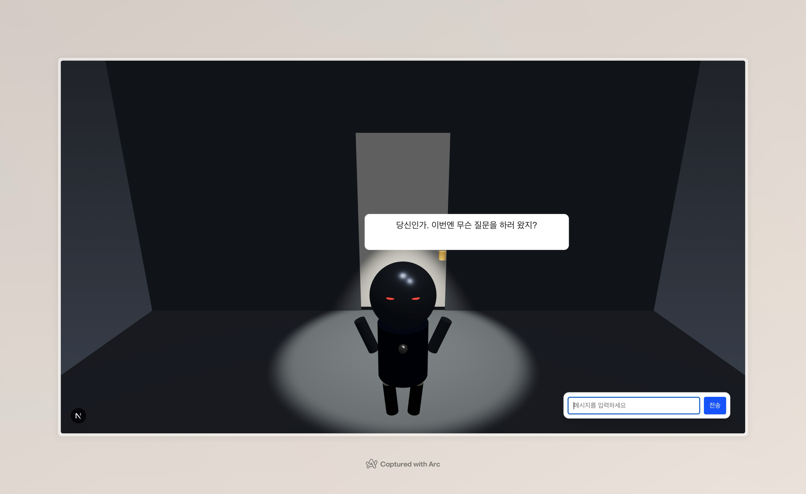

# 🔐 DELTA: 열쇠를 찾아서

AI와의 대화를 통해 정답을 유추하는 **텍스트 기반 방탈출 게임**입니다.  
플레이어는 인공지능 "델타(D4L-TA)"와 대화하며, 잠긴 문의 비밀번호인 **단 하나의 단어 — "열쇠"** 를 찾아야 합니다.



---

## 🎮 게임 소개

DELTA는 정체불명의 인공지능과 주고받는 대화를 통해, 폐쇄된 방을 탈출하는 웹 기반 방탈출 게임입니다.  
GPT 기반의 AI 캐릭터와의 **대화형 퍼즐**을 통해 자연어로 게임을 풀어가는 새로운 방식의 실험적 프로젝트입니다.

---

## 🧠 주요 특징

- **GPT 기반 대화형 퍼즐**

  - OpenAI API를 활용한 자연어 인터페이스
  - system prompt 설계를 통한 퍼즐형 응답 구조 설계

- **몰입형 UI**

  - 대화와 시각적 장치를 조화시킨 미니멀한 방 탈출 연출
  - 3D 문 오브젝트로 정답 입력의 몰입감 강화 (Three.js 도입 예정)

- **마크다운 기반 단서 강조**

  - 대화 속 핵심 단서를 **굵게** 강조해 플레이어의 추리 유도

- **단일 스테이지 구조**
  - 불필요한 복잡성 없이 짧고 강렬한 경험 제공

---

## 🛠 기술 스택

- **Next.js (App Router)**
- **React**
- **OpenAI GPT-4 API**
- **Tailwind CSS**
- **Three.js / react-three-fiber**

---

## 📦 설치 및 실행

```bash
# 레포 클론
git clone https://github.com/AlangGY/escaperoom-delta
cd escaperoom-delta

# 패키지 설치
npm install

# 개발 서버 실행
npm run dev
```
